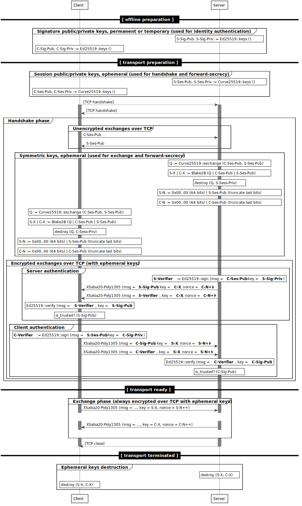

# `gemini://` NaCL protocol v1

## Use-case

This encryption protocol is meant as a replacement for TLS in the context of the `gemini://` protocol (https://gemini.circumlunar.space/), a newer `gopher://` alternative, which basically provides a simpler HTTP `GET`-only alternative.

The following are the requirements, constraints and general guide-lines:
* provide server authentication, with a "trust-on-first-use" model, i.e. like SSH server authentication works (`~/.ssh/known_hosts`);
* provide optional client authentication, based on a whitelist maintained on the server side, i.e. like SSH client authentication works (`~/.ssh/authorized_keys`);
* (no certificate authority required, but if Let's Encrypt certificates can be integrated it is a plus;)
* provide forward-secrecy  (i.e. compromising client or server long-term keys shouldn't allow decrypting previous exchanges);
* provide a message-based framing usable by the application layer;  (i.e. if it provides framing, allow the application to reuse it, don't just present a stream of bytes to the application;)  the size of the messages are usually small, fit in memory, the average being the average HTTP response body of typical internet websites;
* use only the high-level constructs (or low-level if required) provided only by `libsodium` or NaCL;  (i.e. no other cryptographic dependency except `libsodium`;)
* be as simple as possible, without any configuration parameters;
* be correctly implementable by a novice developer without cryptographic expertise;  (thus the emphasis on `libsodium` high-level constructs;)
* provide as much privacy for the client as possible without hampering simplicity or performance;  if needed client privacy can be prioritized over server privacy;
* provide optional "virtual-host" functionality, by which the client can specify the identity of the server it wants to talk to;  (not supported by this proposal;)

## Threat model

* non-nation-state level attackers;
* non-corporate level attackers;
* the main threats would be dumb man-in-the-middle appliances (filtering content or injecting adds, malware, etc.);
* the other omnipresent threat would be privacy, like for example drag-net surveillance by nation-state level actors;
* if I would put a price on "breaking a single session" I would say if it costs more than $1000 to break a given session's encryption, it's not worth it;

## Used cryptographic primitives

It uses only high-level functions provided by `libsodium` (see `libsodium-internals.md`):
* `crypto_secretbox_*` -- based on XSalsa20 and Poly1305, for the message transport providing authenticated encryption based on a per-session ephemeral symmetric key (one in each direction) with incremental nonces;
* `crypto_sign_*` -- based on Ed25519 both for client and server identity authentication;
* `crypto_kx_*` -- based on Curve25519, used to derive the per-session ephemeral symmetric key;
* all packets sent over TCP are framed by prefixing them with the frame length;

How these are used is described in the following diagram:

Observations:
* the `C-Sig-Pub-Key` and `C-Signature` (and similarly for the server) could be concatenated and sent in the same frame, but for simplicity they are kept separate;

## CurveCP questions

The CurveCP protocol (https://curvecp.org/security.html) (authored by Daniel J. Bernstein) answers the following questions, which I'll try to assess for my protocol v1 proposal:

* **Does it provide server authentication?**  Yes (by using the server's permanent public/private key pair).
* **Does it provide client authentication?**  Yes (by using the client's permanent public/private key pair).  If the client doesn't want to have a permanent identity, it can generate transient key pairs (either per client life-time, or per session).
* **Does it stop replay attacks?**  Yes, by both the client and the server generate ephemeral public/private Curve25519 based on which a per-session ephemeral symmetric key (one for each direction) is derived;  thus given that at least one of the peers behave correctly and generates a new ephemeral public/private key, the resulting symmetric key would be unique.  With regard to authentication, given that each peer signs a token the other has sent (in our case the ephemeral public key), authentication can't be replayed.
* **Does it provide passive forward secrecy?**  Yes, as described above, the session is protected by an ephemeral symmetric key, which if neither of the peers stores, can't be recovered.  (The peers shouldn't also store the ephemeral private keys.)
* **Does it provide active forward secrecy?**  Unknown.  (https://en.wikipedia.org/wiki/Forward_secrecy#Weak_perfect_forward_secrecy)
* **Does it provide options to disable encryption and to disable authentication?**  No.  Both encryption and authentication (both for the client and server) are mandatory.
* **Does it provide client address authentication?**  No.  Clients are assumed to have dynamic or roaming IP's.
* **Does it protect against traffic analysis?**  No.  Although the handshake messages have fixed length.  The rest of the messages should be padded accordingly if length obfuscation is required.

## `secure-channel` questions

The `secure-channel` project's author (whose credentials I couldn't assess) proposes the following properties (https://github.com/auditdrivencrypto/secure-channel/blob/master/properties.md) for his peer-to-peer encryption scheme, which I'll try to assess for my protocol v1 proposal:

* content is forward secure?  yes, see answer from CurveCP section;
* server verifies client identity?  yes, as above;
* client verifies server identity?  yes, as above;
* server knows client has verified?  no, however if the client doesn't accept the server's signature, it can just close the connection, thus implicitly signaling this;  (this signal can be forged by an attacker by just interrupting the connection;)
* client knows server has verified?  no, as above;
* resists replay attack?  yes, see answer from CurveCP section;
* resists man-in-the-middle attack?  yes, as above;
* prevents cold calling/war-dialing (only accept calls from clients that know who server is)?  no;  for our use-case this is not relevant;
* eavesdropper cannot learn client key?  yes;
* eavesdropper cannot learn server key?  yes;
* eavesdropper cannot confirm client key?  yes, the server must first authenticate itself, before the client sends its identity;
* eavesdropper cannot confirm server key?  yes/no;  a plain eavesdropper can't see the exchanged identities, however a man-in-the-middle can impersonate a legitimate client and obtain the identity of the server before it has to authenticate itself;
* replay attack cannot learn which client is authorized?  yes, due to forward-security;
* unauthorized client cannot learn server key?  no;
* unauthorized client cannot confirm server key?  no;
* man in the middle cannot learn or confirm client key? yes;
* man in the middle cannot learn or confirm server key? no;

